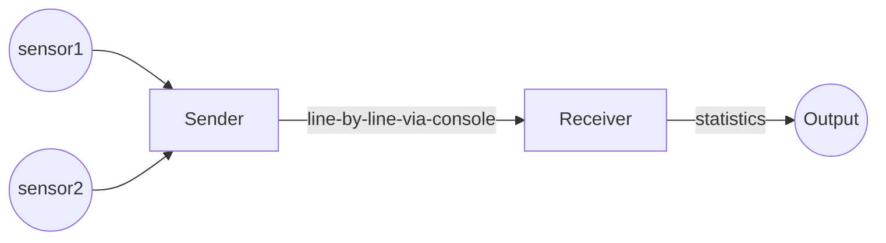

# Streaming BMS Data

This project is about sending and receiving BMS data.

## Decomposition

At a top level, the program runs in two processes - the sender and the receiver.

The Sender simulates and processes data from sensors. It sends data line-by-line to the console, in a format that it defines.
The Receiver inputs this data and computes statistics.

The Sender sends data to the Receiver using [console redirection and pipes](https://ss64.com/nt/syntax-redirection.html).
They need to run on the command-line as follows:

`sender-executable | receiver-executable`

This would make the console-writes of the sender
become the console-reads of the receiver.
It gives us the flexibility of decoupling the sender and receiver -
they can even be written in different languages.

## Phases

The project is divided into two phases:

- Develop the Sender in the first phase, complete with test cases. The syntax and meaning of the data must be evident by reading your test cases.
Do not develop the Receiver yet.

We will instruct you to handover your Sender to another participant and take-over another Sender.

- Develop the Receiver for the Sender you take-over.

## The Interface

We document the interface between the Sender and the Receiver as test cases.

The Sender and Receiver are testable on their own:

- The Sender is testable without the Receiver - so we can develop
for another sensor, test and be confident about integration.
- The Receiver is testable without the Sender - so we can enhance with additional statistics,
without re-testing against all Senders again.

## Decomposition of responsibility

The naming of source files within the Sender and within the Receiver
give their internal decomposition.

## Minimum Functionality

This section lists the minimum functionality of the Sender and Receiver.

### The Sender

- simulates and sends at least two Battery / Charging parameters
- sends fifty readings in a stream
- can either generate values for the parameters, or read from a file
- uses console output to communicate the parameters.

### The Receiver

- reads the parameters from the console input
- after reading every parameter, it prints the following:
    - maximum and minimum values in the incoming stream
    - [simple moving average](https://www.investopedia.com/terms/s/sma.asp) of the last 5 values

## Quality Parameters

Setup the quality parameters of your project (duplication, complexity, coverage, warnings) using GitHub workflow yml files.

Code Flow:
- Read the sensor data for each sensor from the console and stoe in the T_SensorValuesMap
- Calculate the SMA value for the last 5 readings in the sensor readings list
- Find the max and min values from the sensor readings list
- Update these details in T_SensorDataMap for each sensor
- Print these details on the console

Test Specifications
- Operation Action : Receiver reads data from the console
     Required action : 50 readings should be read and stored in the T_SensorValuesMap
- Operation Action : Calculate SMA for each sensor
     Required action : expected sma should be same as actual sma value
- Operation Action : find min max values for each sensor from the list
     Required action : expected min max values should be same as actual min max value
